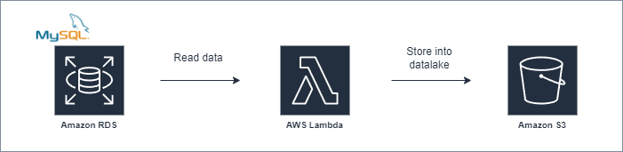

# MySQL To S3 Datalake migration using AWS Lambda
This lambda function execute a complete migration from a MySQL database to an S3 bucket datalake in CSV format.
Each table will be migrated in the following bucket path: **/db_name/table_name/DATA.csv**
It migrates max 1GB table size; anyway you can increase size by attaching more memory/RAM to your lambda.

## Getting started

- Edit config.mjs for your environment
- Edit engine, memory, timeout settings of your lambda (see example aws_sam.yaml provided)
- Attach policies to lambda (see example aws_sam.yaml provided)
- Deploy lambda
- Test with empty body
- Set CloudWatch scheduled event